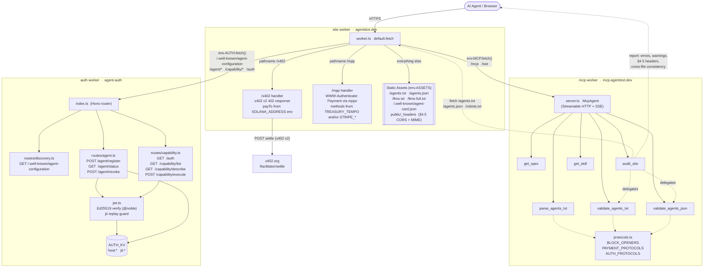

# agents.txt

**An open standard for AI agent capability declarations on the web.**

[](spec/AGENTS-TXT-STANDARD.md)
[](spec/AGENTS-TXT-STANDARD.md)
[](https://agentstxt.dev)
[](https://github.com/agentstxt/agents.txt)

`agents.txt` is the discovery file an AI agent reads to find out what your site supports (payments, authorization, MCP servers, agent skills) without needing to know the implementation details of any particular protocol.

It fills **Layer 4** of the agent-readiness stack:

```
Layer 1 — ACCESS CONTROL      /robots.txt   (RFC 9309)         "You may enter my house"
Layer 2 — PAGE INVENTORY      /sitemap.xml  (sitemaps.org 0.9) "Here's how to navigate it"
Layer 3 — CONTENT BRIEFING    /llms.txt     (llmstxt.org)      "Here's what's inside"
Layer 4 — AGENT CAPABILITIES  /agents.txt   (this spec)        "Here's what you can do here"
```

Where the existing layers handle access policies, indexes, and content guidance, `agents.txt` declares **what an agent can do**: pay, authenticate, connect to an MCP server, fetch installable skills. The implementation always lives in the protocol's own layer (`402` response bodies, `/.well-known/agent-configuration`, MCP transport, etc.); `agents.txt` is the announcement, never the duplicate.

This repository contains:

- **The spec**: [`spec/AGENTS-TXT-STANDARD.md`](spec/AGENTS-TXT-STANDARD.md) (CC0)
- **A live reference deployment** at [agentstxt.dev](https://agentstxt.dev): Astro site + Cloudflare Worker
- **An MCP server** at [mcp.agentstxt.dev](https://mcp.agentstxt.dev): exposes the spec to agents via Model Context Protocol
- **An agent-auth Cloudflare Worker**: Ed25519 JWT verification, `/.well-known/agent-configuration`, capability execution

---

## What `agents.txt` looks like

```
# agents.txt
# Spec: https://agentstxt.dev

Site-Name: My Site
Site-URL: https://mysite.com

Protocols: x402, mpp
Authorization: agent-auth
MCP: https://mysite.com/mcp
Skills: https://mysite.com/skills/main/SKILL.md
A2A: https://mysite.com/.well-known/agent-card.json
```

That's it. Seven directives, plain UTF-8, served at `/agents.txt`. Each directive declares that the site *supports* a protocol; the protocol-specific details (pricing, scopes, transport, skill manifests, AgentCard fields) live in the protocol's own discovery surface.

The structured companion **`agents.json`** carries the same information in machine-friendly JSON with richer per-block detail (chain identifiers, default pricing, capability descriptions). Sites SHOULD serve both, same relationship as `llms.txt` and `llms-full.txt`.

---

## Adopting the standard

You have three paths, in increasing automation:

### 1. Hand-write it

The format is plain text. Read [the spec](spec/AGENTS-TXT-STANDARD.md), copy the directives that apply to your site, save the file as `/agents.txt`. Repeat for `agents.json` if you want the structured companion. Total time: 5 minutes.

### 2. Generate it

The community reference generator [**herald**](https://github.com/agentstxt/agents.txt) (a sibling project, distributed via npm) emits `agents.txt`, `agents.json`, `robots.txt`, `llms.txt`, and `sitemap.xml` from a single config file. Useful if you also want the lower layers of the stack regenerated alongside, or if you're hosting on Express / Hono / Next.js and want a payment middleware wired up automatically.

```bash
npm install -D @herald/cli
herald init
herald generate --out ./public
```

herald is **a nice-to-have, not a requirement**. The spec is implementation-agnostic; anyone can write a generator in any language. herald exists because we needed a first-party adoption path; it shouldn't dictate yours.

### 3. Look at the reference site

The live deployment at [agentstxt.dev](https://agentstxt.dev) is a working agentic site. Source: [`site/`](site/). It hand-rolls a synthetic gated route at `/x402` inside [`site/src/worker.ts`](site/src/worker.ts) so you can read a real, dependency-free implementation of an x402 v2 402 response on Solana. Use it as a reference when building your own server.

---

## Capability blocks

The spec defines five capability blocks. A site emits only the blocks that apply to it; all are optional.

| Block | Directive(s) | What it declares |
|-------|--------------|------------------|
| Payments (§8) | `Protocols:` (opens the block), `Payments: required` (optional policy hint) | Which payment protocols the site speaks. Currently registered identifiers: `x402`, `mpp`. |
| Authorization (§11) | `Authorization:` (opens the block), `Identity: required` (optional policy hint) | Which agent-identity protocols the site speaks. Currently registered: `agent-auth`. |
| MCP (§6) | `MCP:` (repeatable) | Model Context Protocol endpoint URLs. Streamable HTTP transport. |
| Skills (§7) | `Skills:` (repeatable) | Agent skill package URLs ([agentskills.io](https://agentskills.io)). |
| A2A (§9) | `A2A:` (repeatable) | A2A AgentCard URLs ([a2a-protocol.org](https://a2a-protocol.org)). One line per AgentCard, HTTPS only. Complements the canonical well-known path `/.well-known/agent-card.json` for multi-agent sites and non-canonical AgentCard locations. Agent metadata stays in the AgentCard itself; `agents.txt` carries only the URL. |

Blocks are separated by blank lines. Unknown keys are ignored by parsers (forward-compatible). Each block has independent semantics: removing the `Authorization:` block never requires changes to `MCP:` or `Skills:`, and so on.

---

## Adding a new protocol

The spec is **deliberately small** and protocol-agnostic. New protocols can be advertised in three ways, in increasing levels of formalization.

### 1. Use the `x-` prefix (experimental, no spec change)

A protocol that has not been registered in this spec yet can be advertised using the `x-` prefix (`x-mypay`, `x-myauth`) per §3.1. Parsers MUST accept it; validators MUST NOT warn. The same convention extends to `agents.json` per-protocol object keys (`payments["x-mypay"]`). This is the runway for a protocol to be tested in the wild before promotion.

```
# agents.txt
Protocols: x402, x-mypay
```

```json
// agents.json
{ "payments": { "x402": { "chains": ["eip155:8453"] }, "x-mypay": {} } }
```

Site authors decide their own runtime semantics for an experimental protocol (response shape, headers, settlement). No coordination with this spec is required. Once the protocol stabilizes and there is demand, the identifier may be promoted to a registered name in a future spec version, retiring the `x-` form.

### 2. Register an identifier in an existing block (PR against §8 or §11)

When a payment protocol or authorization protocol has a stable specification of its own and ecosystem demand, it can be registered by adding a subsection to §8 (Payment Protocols) or §11 (Authorization Protocols). The bar is editorial:

- Open a PR against [`spec/AGENTS-TXT-STANDARD.md`](spec/AGENTS-TXT-STANDARD.md).
- Add a subsection describing what the identifier signals to an agent and where the protocol's own details live (well-known path, response challenge, SDK).
- Bump the `Version:` line because semantics change.
- Mirror the addition in the reference deployment: append the identifier to [`mcp/src/protocols.ts`](mcp/src/protocols.ts) so the MCP validators and `audit_site` tool accept it without warnings.
- If the protocol has structured fields in `agents.json` (chains, methods, etc.), document the per-protocol object shape in §5.2 and §5.3.

Discussion happens in the PR. Two reviewer approvals are required for structural spec changes.

### 3. Add a new capability block (RFC against the spec)

When a protocol does not fit any existing block (the way A2A did not fit under Payments, Authorization, MCP, or Skills), it gets its own block and a new directive name. This is a structural change and requires RFC-style discussion in the PR.

The **A2A block (§9), added in v1.0**, is the most recent worked example. The shape it takes:

1. **Spec section** in `AGENTS-TXT-STANDARD.md`. New section that defines the directive (`A2A:`), the wire format (one HTTPS URL per line, repeatable), the discovery gap it fills (multi-agent sites, non-canonical AgentCard paths), and the relationship to existing blocks (independent: `A2A:` and `Authorization:` do not constrain each other).
2. **Directive table entry** in §3.1.
3. **Companion entry in `agents.json` schema** (§5.2). For A2A: an `a2a: [ { url, description? } ]` array, symmetric with `mcp[]` and `skills[]`. The description field is `agents.json`-only; `agents.txt` carries only the URL because the announcement layer stays terse.
4. **Reference deployment update**:
   - [`mcp/src/protocols.ts`](mcp/src/protocols.ts) registers the directive in `BLOCK_OPENERS` so parsers and audit tools treat it as a known block opener (not as an unknown directive surfaced under `extensions`).
   - [`mcp/src/tools/parse_agents_txt.ts`](mcp/src/tools/parse_agents_txt.ts) collects the values into the structured output.
   - [`mcp/src/tools/validate_agents.ts`](mcp/src/tools/validate_agents.ts) and [`audit_site.ts`](mcp/src/tools/audit_site.ts) validate URL shape, HTTPS, and the cross-file consistency rule that the URL set in `agents.txt` equals the URL set in `agents.json`.
5. **Reference site update**: if the reference deployment itself adopts the new block, the corresponding `agents.txt` and `agents.json` artifacts in [`site/public/`](site/public/) are regenerated.

The spec is forward-compatible by design: parsers ignore unknown directives, so an `A2A:` line written before a parser knew about it is silently dropped, not rejected. New blocks therefore never break existing sites or existing agents.

---

## Repository layout

```
agentstxt/
├── spec/
│   └── AGENTS-TXT-STANDARD.md   — the formal specification (CC0)
│
├── site/                        — agentstxt.dev — Astro + Cloudflare Worker
│   ├── src/
│   │   ├── pages/               (homepage, /demo/*, /spec/*)
│   │   ├── worker.ts            (BFF + /x402 demo route, hand-rolled x402 v2 on Solana)
│   │   └── ...
│   ├── public/                  (agents.txt, agents.json, llms.txt, llms-full.txt — generated artifacts)
│   ├── agentsjson.config.js
│   └── wrangler.json
│
├── mcp/                         — mcp.agentstxt.dev — Cloudflare Worker
│   └── src/                     (MCP server: get_spec, parse_agents_txt, validate_*, get_skill, check_site)
│
├── auth/                        — agent-auth — Cloudflare Worker
│   └── src/                     (Ed25519 JWT, KV agent state, /.well-known/agent-configuration,
│                                 /agent/register, /capability/execute)
│
├── landingpage/                 — agents-txt-landingpage (separate marketing site)
│
├── skills/                      — Claude/agent skills for working in this repo
│   └── adopt-agents-txt/        (helps a developer adopt the spec)
│
├── package.json                 — private monorepo root, orchestrates per-sub-pkg scripts
├── pnpm-workspace.yaml          — site, mcp, auth
├── README.md                    — this file
├── AGENTS.md                    — repo orientation for AI agents working on this codebase
├── CLAUDE.md                    — Claude-specific operating instructions for this repo
```

---

## Development

```bash
# Setup
cd agentstxt
nvm use 24
pnpm install

# Build everything (site + workers)
pnpm build

# Run tests (auth has 55, the others have none)
pnpm test

# Per sub-package
pnpm site:dev          # Astro dev server for agentstxt.dev
pnpm mcp:dev           # Wrangler dev for the MCP worker
pnpm auth:dev          # Wrangler dev for the agent-auth worker

pnpm site:deploy       # Astro build + wrangler deploy
pnpm mcp:deploy        # Wrangler deploy (minified)
pnpm mcp:deploy:prod
pnpm auth:deploy
pnpm auth:deploy:prod
```

Each sub-package owns its own toolchain: Astro for the site, Wrangler + `tsc --noEmit` for the workers. There is no Turbo at this level because the three workers have no shared dependency graph; they're three independent edge deployments to the same domain group.

---

## Architecture

The reference deployment is **three independent Cloudflare Workers** plus the static Astro build. They share no internal modules; coupling is limited to service-binding `fetch()` calls at the edge, and each worker can be redeployed without touching the others. The `site` worker is the Backend-For-Frontend at `agentstxt.dev`: it serves the static spec artifacts, proxies a fixed prefix list into the `mcp` and `auth` workers via Wrangler service bindings, and exposes two synthetic gated routes that demonstrate the wire shape of each payment protocol independently. `/x402` returns an x402 v2 `402` with `payTo` from `SOLANA_ADDRESS`. `/mpp` returns a `WWW-Authenticate: Payment` challenge composed by `mppx` from `TREASURY_TEMPO` (Tempo) and/or `STRIPE_SECRET_KEY`+`STRIPE_NETWORK_ID` (Stripe). Per spec §8.1 / §8.2 / §5.4 the recipient wallet appears only in the 402 response (in `accepts[].payTo` for x402, inside the base64-encoded `request` parameter of the `WWW-Authenticate` header for MPP) and never in `agents.json`.

The site **self-validates** through a closed loop. The `audit_site` MCP tool fetches `agentstxt.dev`'s own `/agents.txt`, `/agents.json`, and `/robots.txt`, then runs them through the same `validate_agents_txt` and `validate_agents_json` validators that any third party would use. The shared source of truth for accepted directives lives in [`mcp/src/protocols.ts`](app/mcp/src/protocols.ts) (`BLOCK_OPENERS`, `PAYMENT_PROTOCOLS`, `AUTH_PROTOCOLS`); changing a registered identifier there immediately affects every parser, validator, and audit pass.



### How the workers cooperate at request time

| Path prefix (on `agentstxt.dev`) | Handled by | Entry point |
|---|---|---|
| `/agents.txt`, `/agents.json`, `/llms.txt`, `/.well-known/agent-card.json` | site → static assets | [`site/public/`](app/site/public/) + [`_headers`](app/site/public/_headers) |
| `/x402` | site, inline | [`worker.ts`](app/site/src/worker.ts) (synthetic gated route, x402 v2 on Solana, `payTo` from `SOLANA_ADDRESS`) |
| `/mpp`  | site, inline | [`worker.ts`](app/site/src/worker.ts) (synthetic gated route, MPP via `mppx`, methods from `TREASURY_TEMPO` and/or `STRIPE_SECRET_KEY`+`STRIPE_NETWORK_ID`, signed with `MPP_SECRET_KEY`) |
| `/mcp`, `/sse` | site → mcp (service binding) | [`mcp/src/server.ts`](app/mcp/src/server.ts) |
| `/.well-known/agent-configuration`, `/agent/*`, `/capability/*`, `/auth` | site → auth (service binding) | [`auth/src/index.ts`](app/auth/src/index.ts) |

Prefix lists `MCP_PREFIXES` and `AUTH_PREFIXES` are declared at the top of [`worker.ts`](app/site/src/worker.ts) and matched with `proxyTo()`. Any path not matching a prefix and not equal to `/x402` or `/mpp` falls through to `env.ASSETS.fetch(request)`.

### Self-validation: the audit loop

The site, the spec, and the MCP validators form a triangle that the project keeps consistent in CI and at runtime:

1. **Source of truth** — [`mcp/src/protocols.ts`](app/mcp/src/protocols.ts) lists every registered directive and identifier. Spec changes flow into this file in the same PR.
2. **Validators** — [`validate_agents.ts`](app/mcp/src/tools/validate_agents.ts) exposes `validate_agents_txt` and `validate_agents_json` against `protocols.ts`. They run on raw user input and on the site's own artifacts.
3. **Audit** — [`audit_site.ts`](app/mcp/src/tools/audit_site.ts) (`audit_site` tool) fetches a live origin's `/agents.txt`, `/agents.json`, and `/robots.txt`; calls `parseAgentsTxt` + `validateParsed`; checks §4.5 HTTP headers (`Content-Type`, `Access-Control-Allow-Origin: *`, `Cache-Control`); and enforces the cross-file consistency rule (the URL set in `agents.txt` MUST equal the URL set in `agents.json`).
4. **Closed loop** — pointing `audit_site` at `https://agentstxt.dev` runs the site against its own spec through the `site → static assets` path and the `mcp → audit_site → site` path. A clean run is the production health check.

### Where to read each piece end-to-end

- **Astro → Cloudflare static serving + §4.5 headers** — [`site/public/_headers`](app/site/public/_headers), [`site/astro.config.mjs`](app/site/astro.config.mjs)
- **x402 v2 wire shape** — [`site/src/worker.ts`](app/site/src/worker.ts), `/x402` handler, single Solana chain, no dependency indirection
- **MPP wire shape** — [`site/src/worker.ts`](app/site/src/worker.ts), `/mpp` handler, `Mppx.compose(tempo, stripe)` via the `mppx` SDK, returns `WWW-Authenticate: Payment` with the recipient base64-encoded inside the `request` parameter
- **MCP tool registration pattern** — [`mcp/src/server.ts`](app/mcp/src/server.ts) plus the six `registerXxx(server)` functions in [`mcp/src/tools/`](app/mcp/src/tools/)
- **Ed25519 agent-auth handshake** — [`auth/src/jwt.ts`](app/auth/src/jwt.ts) verifies, [`routes/agent.ts`](app/auth/src/routes/agent.ts) registers + revokes, [`routes/capability.ts`](app/auth/src/routes/capability.ts) gates execution; KV holds `host:{thumbprint}` records and `jti:{id}` replay markers

---

## Status

**Spec:** v1.0. Format and schema are stable. Major capability blocks (Payments, Authorization, MCP, Skills) are settled. Patches accepted via PR; structural changes will be RFCs against [`spec/AGENTS-TXT-STANDARD.md`](spec/AGENTS-TXT-STANDARD.md).

**Reference deployment:** Live at [agentstxt.dev](https://agentstxt.dev). The MCP server is live at [mcp.agentstxt.dev](https://mcp.agentstxt.dev). The agent-auth worker runs as a separate service.

**Adoption:** Open. The spec is CC0; anyone can implement it without restriction. The reference workers in this repo are Apache 2.0; vendor in or fork freely.

---

## Contributing

PRs welcome on:

- **Spec** (`spec/AGENTS-TXT-STANDARD.md`): RFC-style discussion in the PR description for any structural change. Editorial fixes can ship directly.
- **Reference site** (`site/`): bug fixes, new demo pages, content updates.
- **MCP server** (`mcp/`): new tools, validator improvements.
- **Agent-auth worker** (`auth/`): capability extensions, scope improvements.

Issues and discussion: [github.com/agentstxt/agents.txt](https://github.com/agentstxt/agents.txt).

If you build a parser, generator, validator, or middleware for `agents.txt` in another language or framework — open a PR adding it to the implementations list (TBD section in the spec).

---

## License

This repository is dual-licensed. The specification and the reference code are released under different terms, and each license is included as a separate file in the repository:

- **Specification** (`spec/AGENTS-TXT-STANDARD.md`): [CC0 1.0 Universal](https://creativecommons.org/publicdomain/zero/1.0/), see [`LICENSE-CC0`](LICENSE-CC0). Public domain dedication: implement, fork, or vendor without permission or attribution.
- **Reference workers and site** (`site/`, `mcp/`, `auth/`, `landingpage/`): [Apache License 2.0](https://www.apache.org/licenses/LICENSE-2.0), see [`LICENSE`](LICENSE).

GitHub's license detector reads the root `LICENSE` file and labels the repository Apache-2.0; the spec license lives alongside it as `LICENSE-CC0` and applies to the contents of `spec/`.
