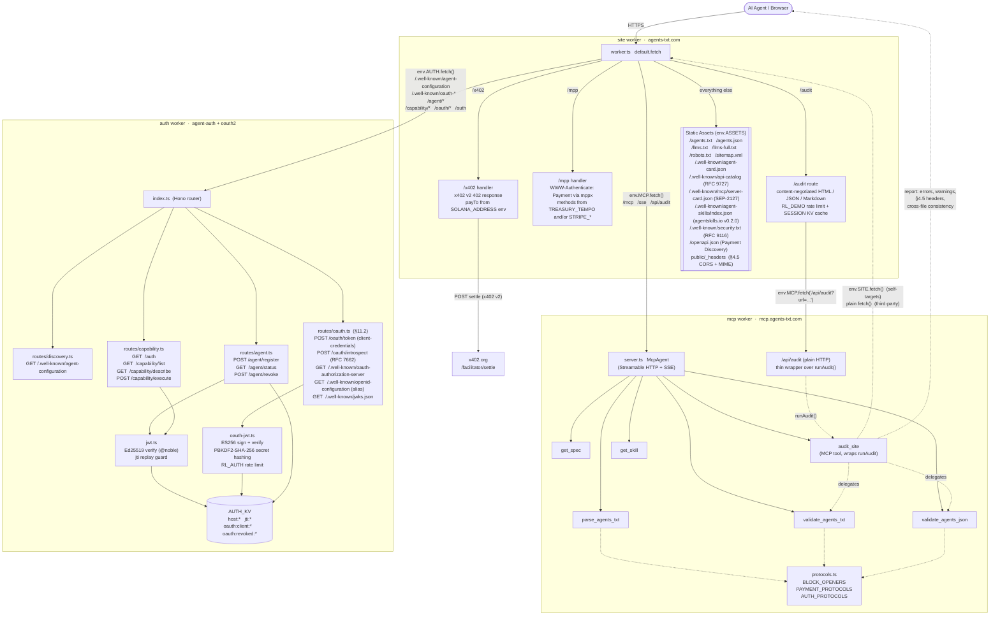

<picture>
  <source media="(prefers-color-scheme: dark)" srcset="assets/agents-txt/wordmark-dark.svg">
  
</picture>

**The declarative capability discovery layer of the agent-native web.**

[](spec/AGENTS-TXT-STANDARD.md)
[](spec/AGENTS-TXT-STANDARD.md)
[](https://agents-txt.com)
[](https://github.com/agents-txt/agents-txt)

Two files at the site root: `/agents.txt` (plain text, one directive per line) and `/agents.json` (structured companion). Agents fetch them on first contact and learn what the site supports: payment protocols, authorization schemes, MCP servers, skill packages, A2A AgentCards. No crawling. No protocol probing. No SDK to bundle. Implementation details live inside each protocol's own response surface; the discovery layer stays thin, static-cacheable, CC0-licensed, and protocol-agnostic by design.

It fills **Layer 4** of the agent-readiness stack:

```
Layer 1 — ACCESS CONTROL      /robots.txt   (RFC 9309)         "You may enter my house"
Layer 2 — PAGE INVENTORY      /sitemap.xml  (sitemaps.org 0.9) "Here's how to navigate it"
Layer 3 — CONTENT BRIEFING    /llms.txt     (llmstxt.org)      "Here's what's inside"
Layer 4 — AGENT CAPABILITIES  /agents.txt   (this spec)        "Here's what you can do here"
```

Layers 1 through 3 govern access, inventory, and content. None of them say *what an agent can do once it's there*. `agents.txt` is the answer: pay, authenticate, talk to an MCP server, fetch installable skills. The how always lives in the protocol's own layer (`402` response bodies, `/.well-known/agent-configuration`, MCP transport). `agents.txt` is the announcement, never the duplicate.

This repository contains:

- **The spec**: [`spec/AGENTS-TXT-STANDARD.md`](spec/AGENTS-TXT-STANDARD.md), CC0
- **A live reference deployment** at [agents-txt.com](https://agents-txt.com): Astro site + Cloudflare Workers with demos
- **An MCP server** at [mcp.agents-txt.com](https://mcp.agents-txt.com): exposes the spec to agents via Model Context Protocol; the `audit_site` tool lets any agent compliance-check any URL
- **An agent-auth Cloudflare Worker**: Ed25519 JWT verification, `/.well-known/agent-configuration`, capability execution
- **A live audit surface** at [agents-txt.com/audit](https://agents-txt.com/audit): paste any URL, get HTML / JSON / Markdown depending on the `Accept` header
- **A hosted JSON Schema** at [agents-txt.com/schema/agents-json/v1.0.json](https://agents-txt.com/schema/agents-json/v1.0.json): the canonical JSON Schema 2020-12 document describing the `agents.json` wire format. Operators who reference it from their own `agents.json` (via the `$schema` field) get inline validation and autocomplete in any JSON-aware editor.

---

## What `agents.txt` looks like

```
# agents.txt
# Standard: https://agents-txt.com
# JSON: https://mysite.com/agents.json

Protocols: x402, mpp, ap2

Authorization: agent-auth, oauth2

MCP: https://mysite.com/mcp

Skills: https://mysite.com/skills/main/SKILL.md

A2A: https://mysite.com/.well-known/agent-card.json

UCP: https://mysite.com/.well-known/ucp
```

That's it. Six directive types, plain UTF-8, served at `/agents.txt`. Each directive declares that the site *supports* a protocol; per-protocol details (pricing, scopes, transport, skill manifests, AgentCard fields) live in that protocol's own discovery surface, never duplicated here.

The structured companion **`agents.json`** carries the same information in machine-friendly JSON with richer per-block detail (chain identifiers, default pricing, capability descriptions). Sites SHOULD serve both, same relationship as `llms.txt` and `llms-full.txt`.

---

## Your site, your discovery shape

Once `/agents.txt` and `/agents.json` are live, the standard composes. Publish any extra discovery file your site needs and reference it from `agents.json`. Parsers ignore fields they do not recognise by design, so new fields layer on without breaking old ones.

`/agents.json` on your site declares whatever surfaces matter to you:

```json
{
  "version":   "1.0",
  "mcp":       [...],
  "skills":    [...],
  "changelog": "https://yoursite.com/changelog.json",
  "docs":      "https://docs.yoursite.com"
}
```

This example shows two patterns at once. **`docs`** is a *subdomain* reference: an agent that wants documentation knows to fetch a different host. **`changelog`** is a *nested* reference: the URL resolves to a JSON index that itself points at per-version detail files, each one its own resource at its own URL. Here is what the index looks like:

```json
{
  "version": "1.0",
  "releases": [
    {
      "version": "2.4.0",
      "date":    "2026-05-12",
      "notes":   "https://yoursite.com/changelog/2.4.0.md"
    },
    {
      "version": "2.3.0",
      "date":    "2026-04-28",
      "notes":   "https://yoursite.com/changelog/2.3.0.md"
    }
  ]
}
```

An agent that found `/agents.json` first now knows your docs live on a sibling subdomain and your changelog has a structured index with per-version markdown. No scraping, no probing, no SDK. The same pattern works for `/openapi.json` (OpenAPI spec), `/.well-known/*` files for emerging standards, the `x-` prefix for experimental identifiers, and any custom JSON your site needs to advertise. The shape stays yours.

---

## Adopting the standard

You have three paths, in increasing automation:

### 1. Hand-write it

The format is plain text. Read [the spec](spec/AGENTS-TXT-STANDARD.md), copy the directives that apply to your site, save the file as `/agents.txt`. Repeat for `agents.json` if you want the structured companion. Total time: 5 minutes.

For the `agents.json` companion, add a `$schema` field at the top pointing at the canonical JSON Schema:

```json
{
  "$schema": "https://agents-txt.com/schema/agents-json/v1.0.json",
  "version": "1.0",
  "standard": "https://agents-txt.com",
  "site": { "name": "My Site", "url": "https://mysite.com" }
}
```

Any JSON-aware editor (VS Code, JetBrains, Helix with the JSON LSP, `jq --schema`) reads that URL and offers inline validation plus autocomplete the moment you open the file. A typo in `payments.mpp.methods`, a missing required field, a non-https URL in `mcp[].url` all surface in the editor before the file is ever served. The schema document lives on this site and is regenerated from the Zod source whenever the wire format changes; the v1.0 URL stays stable as a frozen reference.

### 2. Generate it

The community reference generator [**herald**](https://github.com/agents-txt/herald) (a sibling project, distributed via npm) emits `agents.txt`, `agents.json`, `robots.txt`, `llms.txt`, and `sitemap.xml` from a single config file. Useful if you also want the lower layers of the stack regenerated alongside, or if you're hosting on Express / Hono / Next.js and want a payment middleware wired up automatically.

```bash
npm install -D @herald/cli
herald init
herald emit --out ./public
```

herald is **a nice-to-have, not a requirement**. The spec is implementation-agnostic; anyone can write a generator in any language. herald exists because we needed a first-party adoption path; it shouldn't dictate yours.

### 3. Look at the reference site

The live deployment at [agents-txt.com](https://agents-txt.com) is a working agentic site, and the single source of truth for everything it advertises is one config file: [`app/site/agentsjson.config.js`](app/site/agentsjson.config.js). Read it to see how the composability pattern in [*Your site, your discovery shape*](#your-site-your-discovery-shape) plays out for real: every directive in the live `/agents.txt`, every block in the live `/agents.json`, and every ecosystem discovery surface (`/.well-known/api-catalog`, `/openapi.json`, the MCP server card, the agent-skills index) maps back to a single declaration.

For end-to-end adopter setups in real frameworks, the herald repo ships runnable examples: [`examples/express`](https://github.com/agents-txt/herald/tree/main/examples/express) and [`examples/nextjs`](https://github.com/agents-txt/herald/tree/main/examples/nextjs). Each shows the same config-driven pattern wired into a host framework's build pipeline.

If you want a generator handling all of this for you, `herald emit` (path 2 above) is what the reference deployment uses. It reads one config file, emits the discovery surfaces, and keeps them in sync on every build. You can also hand-roll your own generator or hand-write the files; the spec is implementation-agnostic.

---

## Capability blocks

The spec defines an open set of capability blocks. The blocks below are the ones currently registered; new ones land in future spec versions via the standard extension process (`x-` prefix runway, then formal block-opener registration). A site emits only the blocks that apply to it; all are optional.

| Block | Directive(s) | What it declares |
|-------|--------------|------------------|
| Payments (§8) | `Protocols:` (opens the block), `Payments: required` (optional policy hint) | Which payment protocols the site speaks. Currently registered identifiers: `x402`, `mpp`, `ap2`. |
| Authorization (§11) | `Authorization:` (opens the block), `Identity: required` (optional policy hint) | Which agent-identity protocols the site speaks. Currently registered: `agent-auth`. |
| MCP (§6) | `MCP:` (repeatable) | Model Context Protocol endpoint URLs. Streamable HTTP transport. |
| Skills (§7) | `Skills:` (repeatable) | Agent skill package URLs ([agentskills.io](https://agentskills.io)). |
| A2A (§9) | `A2A:` (repeatable) | A2A AgentCard URLs ([a2a-protocol.org](https://a2a-protocol.org)). One line per AgentCard, HTTPS only. Complements the canonical well-known path `/.well-known/agent-card.json` for multi-agent sites and non-canonical AgentCard locations. Agent metadata stays in the AgentCard itself; `agents.txt` carries only the URL. |
| UCP (§10) | `UCP:` (repeatable) | Universal Commerce Protocol profile URLs ([ucp.dev](https://ucp.dev)). One line per profile, HTTPS only. Complements the canonical well-known path `/.well-known/ucp` for multi-profile sites. The profile document declares services, transport bindings, payment handlers (including the AP2 mandate extension), and signing keys; `agents.txt` carries only the URL. |

Blocks are separated by blank lines. Unknown keys are ignored by parsers (forward-compatible). Each block has independent semantics: removing the `Authorization:` block never requires changes to `MCP:` or `Skills:`, and so on.

---

## Repository layout

```
agents-txt/
├── README.md                        — this file
├── AGENTS.md                        — repo orientation for AI agents working on this codebase
├── CLAUDE.md                        — Claude-specific operating instructions
├── CONTRIBUTING.md                  — contribution rules + PR checklist
├── LICENSE                          — Apache 2.0 (reference code)
├── LICENSE-CC0                      — CC0 (spec text)
├── package.json                     — private monorepo root, orchestrates per-package scripts
├── pnpm-workspace.yaml              — workspace: app/site, app/mcp, app/auth
├── pnpm-lock.yaml
│
├── assets/                          — logos, OG images, brand marks
│
├── app/
│   ├── site/                        — agents-txt.com (Astro 6 + Cloudflare Worker)
│   │   ├── agentsjson.config.js     — source of truth for /agents.txt, /agents.json, ecosystem files
│   │   ├── astro.config.mjs
│   │   ├── wrangler.json
│   │   ├── src/
│   │   │   ├── pages/               — / · /audit · /spec · /demo/*
│   │   │   ├── layouts/             — BaseLayout
│   │   │   ├── components/
│   │   │   ├── content/             — spec/AGENTS-TXT-STANDARD.md (canonical spec)
│   │   │   ├── content.config.ts
│   │   │   ├── config.ts            — SPEC_VERSION constant
│   │   │   ├── styles/              — global.css + Tailwind 4
│   │   │   └── worker.ts            — BFF: /x402, /mpp, /audit, service-binding proxy
│   │   └── public/
│   │       ├── agents.txt           — spec §3 (generated)
│   │       ├── agents.json          — spec §5 (generated)
│   │       ├── openapi.json         — Payment Discovery draft
│   │       ├── _headers             — §4.5 CORS + MIME for static files
│   │       ├── llms.txt
│   │       ├── llms-full.txt
│   │       ├── robots.txt
│   │       ├── sitemap.xml
│   │       ├── skills/              — SKILL.md packages (e.g. adopt-agents-txt/)
│   │       └── .well-known/
│   │           ├── agent-card.json          — A2A (§9)
│   │           ├── ucp                      — UCP (§10)
│   │           ├── api-catalog              — RFC 9727 linkset
│   │           ├── mcp/server-card.json     — SEP-2127 server card
│   │           ├── agent-skills/index.json  — agentskills.io v0.2.0
│   │           └── security.txt             — RFC 9116
│   │
│   ├── mcp/                         — mcp.agents-txt.com (Cloudflare Worker)
│   │   ├── wrangler.jsonc
│   │   └── src/
│   │       ├── server.ts            — McpAgent over Streamable HTTP + SSE
│   │       ├── index.ts             — /api/audit plain-HTTP companion
│   │       ├── protocols.ts         — BLOCK_OPENERS · PAYMENT_PROTOCOLS · AUTH_PROTOCOLS registry
│   │       └── tools/               — get_spec · get_skill · parse_agents_txt · validate_agents · audit_site
│   │
│   └── auth/                        — agent-auth + oauth2 (Cloudflare Worker)
│       ├── wrangler.jsonc
│       └── src/
│           ├── index.ts             — Hono router
│           ├── types.ts             — Env, host/agent records
│           ├── jwt.ts               — Ed25519 parse + verify (@noble)
│           ├── oauth-jwt.ts         — ES256 sign/verify + PBKDF2 client-secret hashing
│           ├── ratelimit.ts         — Per-IP rate-limit binding wrapper
│           ├── routes/              — discovery · agent · capability · oauth
│           └── __tests__/           — Vitest, 81 tests
│
└── skills/                          — Claude / agent skills for working in this repo
    └── adopt-agents-txt/            — walks a developer through adopting the spec on their own site
```

---

## Development

Every Node-running command in this repo expects Node 24 via nvm and the worker-specific build-time env. Two shell prefixes that should run before any `pnpm` command:

```bash
source ~/.nvm/nvm.sh && nvm use 24   # pin Node 24
set -a; source .dev.vars; set +a     # export build-time env (per-worker)
```

`.dev.vars` is a per-worker file (e.g. `app/site/.dev.vars`, `app/auth/.dev.vars`). Each carries the secrets/vars that worker's build or runtime expects (wallet addresses for the site, OAuth signing key for the auth worker, etc.). Without sourcing it, `herald emit` produces a partial `agents.json` and `wrangler deploy` ships without bound secrets.

### Setup

```bash
source ~/.nvm/nvm.sh && nvm use 24
cd agents-txt
pnpm install
```

### Build + test from the monorepo root

```bash
pnpm build          # pnpm -r run build (Astro + tsc --noEmit per worker)
pnpm test           # pnpm -r run test
```

### Per-worker dev

```bash
pnpm site:dev       # Astro dev server for agents-txt.com (port 4321)
pnpm mcp:dev        # wrangler dev for the MCP worker
pnpm auth:dev       # wrangler dev for the agent-auth worker
```

### Deploy

The site deploys with one script. The two workers each have a non-production `deploy` and a `deploy:production`; only `deploy:production` targets the real Cloudflare environment with the real KV namespaces and routes. The non-production `deploy` exists for ad-hoc smoke tests and points at the placeholder KV ids from the top-level `wrangler.json[c]` block (deploys would fail at runtime if you tried to read KV, by design).

```bash
# Site (Astro build + wrangler deploy)
source ~/.nvm/nvm.sh && nvm use 24
cd app/site
set -a; source .dev.vars; set +a
node ../../../HERALD/packages/cli/dist/cli.js emit --out ./public   # if you use herald to generate from env vars.
pnpm run deploy

# MCP worker (production)
source ~/.nvm/nvm.sh && nvm use 24
cd app/mcp
pnpm build && pnpm run deploy:production

# Auth worker (production)
source ~/.nvm/nvm.sh && nvm use 24
cd app/auth
pnpm build && pnpm test && pnpm run deploy:production
```

The non-production `pnpm run deploy` on the MCP and auth workers (without `:production`) exists for quick checks but targets the top-level `wrangler.json[c]` block which has `id: preview_id_placeholder` on the KV binding. Cloudflare rejects that placeholder at deploy time with error 10042 against any real namespace. **Always use `:production`** for the workers; `pnpm run deploy` is reserved for the site (which has no KV binding ambiguity).

### Convenience aliases at the monorepo root

If you prefer not to `cd` between sub-packages, the root `package.json` mirrors each script with a `<pkg>:` prefix and forwards to the sub-package via `pnpm --filter`. Run these from `agents-txt/`:

```bash
pnpm site:deploy           # → app/site:  pnpm run deploy
pnpm mcp:deploy:prod       # → app/mcp:   pnpm run deploy:production
pnpm auth:deploy:prod      # → app/auth:  pnpm run deploy:production
```

`pnpm mcp:deploy` and `pnpm auth:deploy` (without `:prod`) also forward to the per-worker non-production `deploy` and are subject to the same placeholder caveat above.

Each sub-package owns its own toolchain: Astro for the site, Wrangler + `tsc --noEmit` for the workers. There is no Turbo at this level because the three workers have no shared dependency graph; they're three independent edge deployments to the same domain group.

---

## Architecture

The reference deployment is **three independent Cloudflare Workers** plus the static Astro build. They share no internal modules; coupling is limited to service-binding `fetch()` calls at the edge, and each worker can be redeployed without touching the others. The `site` worker is the Backend-For-Frontend at `agents-txt.com`: it serves the static spec artifacts, proxies a fixed prefix list into the `mcp` and `auth` workers via Wrangler service bindings, and exposes two synthetic gated routes that demonstrate the wire shape of each payment protocol independently. `/x402` returns an x402 v2 `402` with `payTo` from `SOLANA_ADDRESS`. `/mpp` returns a `WWW-Authenticate: Payment` challenge composed by `mppx` from `TREASURY_TEMPO` (Tempo) and/or `STRIPE_SECRET_KEY`+`STRIPE_NETWORK_ID` (Stripe). Per spec §8.1 / §8.2 / §5.4 the recipient wallet appears only in the 402 response (in `accepts[].payTo` for x402, inside the base64-encoded `request` parameter of the `WWW-Authenticate` header for MPP) and never in `agents.json`.

The site **self-validates** through a closed loop. The `audit_site` MCP tool fetches `agents-txt.com`'s own `/agents.txt`, `/agents.json`, and `/robots.txt`, then runs them through the same `validate_agents_txt` and `validate_agents_json` validators that any third party would use. The shared source of truth for accepted directives lives in [`mcp/src/protocols.ts`](app/mcp/src/protocols.ts) (`BLOCK_OPENERS`, `PAYMENT_PROTOCOLS`, `AUTH_PROTOCOLS`); changing a registered identifier there immediately affects every parser, validator, and audit pass.

Alongside the spec's canonical `agents.txt` + `agents.json` surfaces, the reference deployment publishes four ecosystem discovery files for readability by scanners that follow other working groups' standards: `/.well-known/api-catalog` (RFC 9727 linkset), `/.well-known/mcp/server-card.json` (SEP-2127 MCP card), `/.well-known/agent-skills/index.json` (agentskills.io Discovery v0.2.0 with sha256 digests), and `/openapi.json` (Payment Discovery `x-payment-info` extensions for the `/x402` and `/mpp` routes). All four are static, all four are generated by `herald emit` from a single config file, and all four are advertised via RFC 8288 `Link:` headers on `/`. The site worker handles HTTP content negotiation: requests with `Accept: text/markdown` on HTML page paths receive `llms-full.txt` with `Content-Type: text/markdown; charset=utf-8`. Spec §12 documents how each of these relates to `agents.txt`; none of them are part of `agents.txt` v1.0, and none of them replace it.



### How the workers cooperate at request time

| Path prefix (on `agents-txt.com`) | Handled by | Entry point |
|---|---|---|
| `/agents.txt`, `/agents.json`, `/llms.txt`, `/.well-known/agent-card.json` | site → static assets | [`site/public/`](app/site/public/) + [`_headers`](app/site/public/_headers) |
| `/x402` | site, inline | [`worker.ts`](app/site/src/worker.ts) (synthetic gated route, x402 v2 on Solana, `payTo` from `SOLANA_ADDRESS`) |
| `/mpp`  | site, inline | [`worker.ts`](app/site/src/worker.ts) (synthetic gated route, MPP via `mppx`, methods from `TREASURY_TEMPO` and/or `STRIPE_SECRET_KEY`+`STRIPE_NETWORK_ID`, signed with `MPP_SECRET_KEY`) |
| `/mcp`, `/sse` | site → mcp (service binding) | [`mcp/src/server.ts`](app/mcp/src/server.ts) |
| `/.well-known/agent-configuration`, `/agent/*`, `/capability/*`, `/auth` | site → auth (service binding) | [`auth/src/index.ts`](app/auth/src/index.ts) |

Prefix lists `MCP_PREFIXES` and `AUTH_PREFIXES` are declared at the top of [`worker.ts`](app/site/src/worker.ts) and matched with `proxyTo()`. Any path not matching a prefix and not equal to `/x402` or `/mpp` falls through to `env.ASSETS.fetch(request)`.

### Self-validation: the audit loop

The site, the spec, and the MCP validators form a triangle that the project keeps consistent in CI and at runtime:

1. **Source of truth.** [`mcp/src/protocols.ts`](app/mcp/src/protocols.ts) lists every registered directive and identifier. Spec changes flow into this file in the same PR.
2. **Validators.** [`validate_agents.ts`](app/mcp/src/tools/validate_agents.ts) exposes `validate_agents_txt` and `validate_agents_json` against `protocols.ts`. They run on raw user input and on the site's own artifacts.
3. **Audit.** [`audit_site.ts`](app/mcp/src/tools/audit_site.ts) (`audit_site` tool) fetches a live origin's `/agents.txt`, `/agents.json`, and `/robots.txt`; calls `parseAgentsTxt` + `validateParsed`; checks §4.5 HTTP headers (`Content-Type`, `Access-Control-Allow-Origin: *`, `Cache-Control`); and enforces the cross-file consistency rule (the URL set in `agents.txt` MUST equal the URL set in `agents.json`).
4. **Closed loop.** Pointing `audit_site` at `https://agents-txt.com` runs the site against its own spec through the `site → static assets` path and the `mcp → audit_site → site` path. A clean run is the production health check.

### Where to read each piece end-to-end

| Spec | Concern | Where it lives |
|------|---------|----------------|
| §4.5 | Static serving + response headers | [`site/public/_headers`](app/site/public/_headers) · [`site/astro.config.mjs`](app/site/astro.config.mjs) |
| §6 | MCP tools | [`mcp/src/server.ts`](app/mcp/src/server.ts) + six `registerXxx(server)` files in [`mcp/src/tools/`](app/mcp/src/tools/). `audit_site` exports `runAudit(url, env?)` so [`mcp/src/index.ts`](app/mcp/src/index.ts)'s plain-HTTP `/api/audit` shares one implementation. |
| §7 | Skills | Declared in [`agentsjson.config.js`](app/site/agentsjson.config.js) `skills.urls`. Served from [`site/public/skills/`](app/site/public/skills/). Resolved by the `get_skill` tool at [`mcp/src/tools/get_skill.ts`](app/mcp/src/tools/get_skill.ts). |
| §8.1 | x402 v2 wire shape | [`site/src/worker.ts`](app/site/src/worker.ts) `/x402` handler. Single Solana chain, no dependency indirection. |
| §8.2 | MPP wire shape | [`site/src/worker.ts`](app/site/src/worker.ts) `/mpp` handler. `Mppx.compose(tempo, stripe)` via the `mppx` SDK. Returns `WWW-Authenticate: Payment` with the recipient base64-encoded inside the `request` parameter. |
| §8.3 | AP2 mandate declaration | Declared in [`agentsjson.config.js`](app/site/agentsjson.config.js) `payments.ap2`. Mandate exchange runs over `ap2-protocol.org` and is not implemented here; the field surfaces the trust layer so an agent can pre-screen before the rail (x402 / MPP) settles. |
| §9 | A2A AgentCard | Static file at [`site/public/.well-known/agent-card.json`](app/site/public/.well-known/agent-card.json). Headers (`Content-Type`, CORS) from [`_headers`](app/site/public/_headers). |
| §10 | UCP profile | Static file at [`site/public/.well-known/ucp`](app/site/public/.well-known/ucp). Same emission pattern as the A2A card. |
| §11.1 | agent-auth · Ed25519 JWT | [`auth/src/jwt.ts`](app/auth/src/jwt.ts) verifies. [`routes/agent.ts`](app/auth/src/routes/agent.ts) registers + revokes. [`routes/capability.ts`](app/auth/src/routes/capability.ts) gates execution. KV: `host:{thumbprint}`, `jti:{id}` replay markers. |
| §11.2 | OAuth 2.0 client-credentials | [`auth/src/routes/oauth.ts`](app/auth/src/routes/oauth.ts): `/oauth/token`, `/oauth/introspect`, discovery + JWKS. [`auth/src/oauth-jwt.ts`](app/auth/src/oauth-jwt.ts): ES256 sign/verify + PBKDF2-SHA-256 (100K iterations, Workers runtime ceiling). KV: `oauth:client:*`, `oauth:revoked:*`. |
| live | Spec-audit endpoint | [`site/src/worker.ts`](app/site/src/worker.ts) `/audit` route + [`audit.astro`](app/site/src/pages/audit.astro) page. Calls MCP `/api/audit` via service binding, content-negotiates HTML / JSON / Markdown, caches in `SESSION` KV for an hour, refuses to cache failures, and offers `?nocache=1` to force a re-run. |

### Adding a new protocol

The spec is **deliberately small** and protocol-agnostic. New protocols can be advertised in three ways, in increasing levels of formalization.

#### 1. Use the `x-` prefix (experimental, no spec change)

A protocol that has not been registered in this spec yet can be advertised using the `x-` prefix (`x-mypay`, `x-myauth`) per §3.1. Parsers MUST accept it; validators MUST NOT warn. The same convention extends to `agents.json` per-protocol object keys (`payments["x-mypay"]`). This is the runway for a protocol to be tested in the wild before promotion.

```
# agents.txt
Protocols: x402, x-mypay
```

```json
// agents.json
{ "payments": { "x402": { "chains": ["eip155:8453"] }, "x-mypay": {} } }
```

Site authors decide their own runtime semantics for an experimental protocol (response shape, headers, settlement). No coordination with this spec is required. Once the protocol stabilizes and there is demand, the identifier may be promoted to a registered name in a future spec version, retiring the `x-` form.

#### 2. Register an identifier in an existing block (PR against §8 or §11)

When a payment protocol or authorization protocol has a stable specification of its own and ecosystem demand, it can be registered by adding a subsection to §8 (Payment Protocols) or §11 (Authorization Protocols). The bar is editorial:

- Open a PR against [`spec/AGENTS-TXT-STANDARD.md`](app/site/src/content/spec/AGENTS-TXT-STANDARD.md).
- Add a subsection describing what the identifier signals to an agent and where the protocol's own details live (well-known path, response challenge, SDK).
- Bump the `Version:` line because semantics change.
- Mirror the addition in the reference deployment: append the identifier to [`app/mcp/src/protocols.ts`](app/mcp/src/protocols.ts) so the MCP validators and `audit_site` tool accept it without warnings.
- If the protocol has structured fields in `agents.json` (chains, methods, etc.), document the per-protocol object shape in §5.2 and §5.3.

Discussion happens in the PR. Two reviewer approvals are required for structural spec changes.

#### 3. Add a new capability block (RFC against the spec)

When a protocol does not fit any existing block (the way A2A did not fit under Payments, Authorization, MCP, or Skills), it gets its own block and a new directive name. This is a structural change and requires RFC-style discussion in the PR.

The **A2A block (§9), added in v1.0**, is the most recent worked example. The shape it takes:

1. **Spec section** in `AGENTS-TXT-STANDARD.md`. New section that defines the directive (`A2A:`), the wire format (one HTTPS URL per line, repeatable), the discovery gap it fills (multi-agent sites, non-canonical AgentCard paths), and the relationship to existing blocks (independent: `A2A:` and `Authorization:` do not constrain each other).
2. **Directive table entry** in §3.1.
3. **Companion entry in `agents.json` schema** (§5.2). For A2A: an `a2a: [ { url, description? } ]` array, symmetric with `mcp[]` and `skills[]`. The description field is `agents.json`-only; `agents.txt` carries only the URL because the announcement layer stays terse.
4. **Reference deployment update**:
   - [`app/mcp/src/protocols.ts`](app/mcp/src/protocols.ts) registers the directive in `BLOCK_OPENERS` so parsers and audit tools treat it as a known block opener (not as an unknown directive surfaced under `extensions`).
   - [`app/mcp/src/tools/parse_agents_txt.ts`](app/mcp/src/tools/parse_agents_txt.ts) collects the values into the structured output.
   - [`app/mcp/src/tools/validate_agents.ts`](app/mcp/src/tools/validate_agents.ts) and [`audit_site.ts`](app/mcp/src/tools/audit_site.ts) validate URL shape, HTTPS, and the cross-file consistency rule that the URL set in `agents.txt` equals the URL set in `agents.json`.
5. **Reference site update**: if the reference deployment itself adopts the new block, the corresponding `agents.txt` and `agents.json` artifacts in [`app/site/public/`](app/site/public/) are regenerated.

The spec is forward-compatible by design: parsers ignore unknown directives, so an `A2A:` line written before a parser knew about it is silently dropped, not rejected. New blocks therefore never break existing sites or existing agents.

---

## Status

**Spec:** v1.0. Format and schema are stable. Major capability blocks (Payments, Authorization, MCP, Skills) are settled. Patches accepted via PR; structural changes will be RFCs against [`spec/AGENTS-TXT-STANDARD.md`](spec/AGENTS-TXT-STANDARD.md).

**Reference deployment:** Live at [agents-txt.com](https://agents-txt.com). The MCP server is live at [mcp.agents-txt.com](https://mcp.agents-txt.com). The agent-auth worker runs as a separate service.

**Adoption:** Open. The spec is CC0; anyone can implement it without restriction. The reference workers in this repo are Apache 2.0; vendor in or fork freely.

---

## Contributing

Contributions are welcome across the repo:

- **Spec** ([`spec/AGENTS-TXT-STANDARD.md`](spec/AGENTS-TXT-STANDARD.md)). Editorial fixes (typos, clarifying examples, broken links) can ship directly. Structural changes (new or modified directives, schema fields, semantics) require an RFC-style note in the PR description: what changes, why, and the migration impact for existing implementations.
- **Reference site** (`site/`). Bug fixes, additional demos, and content improvements.
- **MCP server** (`mcp/`). New audit checks, validator improvements, and additional tools.
- **Agent-auth worker** (`auth/`). Capability extensions and scope refinements.

Downstream implementations (parsers, generators, validators, middleware, CMS plugins) in any language or framework: open a PR to add yours to the implementations list in the spec.

Issues, questions, and proposals: [github.com/agents-txt/agents-txt](https://github.com/agents-txt/agents-txt).

---

## License

This repository is dual-licensed. The specification and the reference code are released under different terms, and each license is included as a separate file in the repository:

- **Specification** (`spec/AGENTS-TXT-STANDARD.md`): [CC0 1.0 Universal](https://creativecommons.org/publicdomain/zero/1.0/), see [`LICENSE-CC0`](LICENSE-CC0). Public domain dedication: implement, fork, or vendor without permission or attribution.
- **Reference workers and site** (`site/`, `mcp/`, `auth/`, `landingpage/`): [Apache License 2.0](https://www.apache.org/licenses/LICENSE-2.0), see [`LICENSE`](LICENSE).

GitHub's license detector reads the root `LICENSE` file and labels the repository Apache-2.0; the spec license lives alongside it as `LICENSE-CC0` and applies to the contents of `spec/`.
